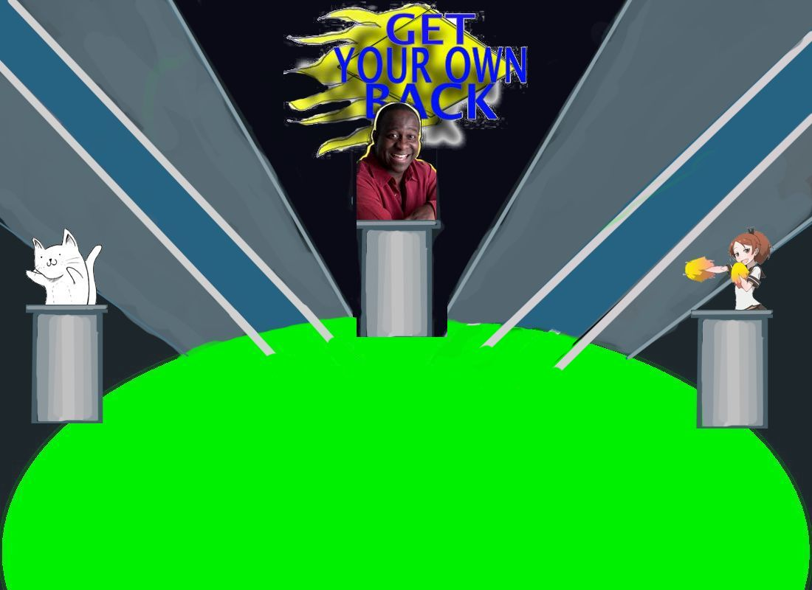
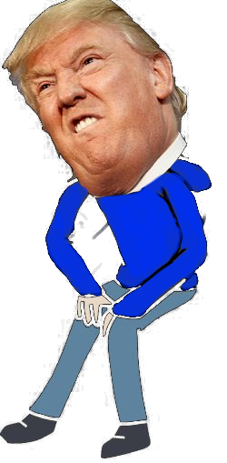
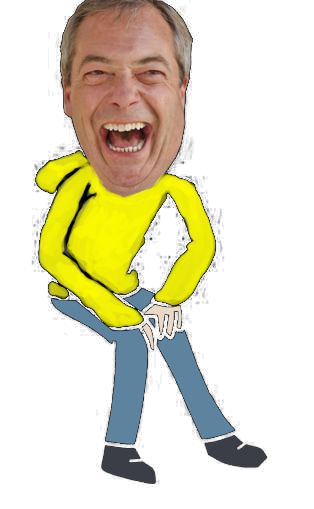

# GET YOUR OWN BACK!

#####Rules

1. Click through to the questions page
2. Player one goes first who is on the yellow team.
3. Answer the multi-choice questions as they appear.
4. If the question is right, either President Trump or Mr Farage will go up the ramp.
5. Whe the 'gung-ee' gets to the top of the ramp and the player has scored 5 points, they will then be gunged by falling into the green goop below.
6. Players can reset if they like at the end of the game or at any point during the game also.
7. If the timer runs out, the player looses and has to start again.

####Approach / How it works

As a basic quiz game, the function pops the last question in the array and displays this with 3 choices for the player.  The player chooses and another function checks that there answer matches that of the correct choice stored in the array.

The screens/divs inter-change depending on the point in the game.

Get Your Own Back was a popular children's TV show that ran from 1991 to 2003 and most popular for it's fidiculous games and obstacle courses and the final round where the contestent's parent/teacher were catapulated into a big pool of gunge.  I wanted to create a game which created nostalga and was memorable.  And although I have found that more people than I thought didn't know or rememember the game, most found 'gunking' Trump or Farage entertaining.

For an example, see [I'm an inline-style link] https://www.youtube.com/watch?v=CqcsLf0vd8s&spfreload=10

This image shows the set before the divs are added.  below are the divs which are President Trump or Mr Farage.

.    

####The build

* HTML 5, CSS and jQuery were used to create this game. 
* Logo and Tv Set were created in Krita.
* sounds were taken from youtube clips (see below), converted using https://www.onlinevideoconverter.com/video-converter and cut down using http://mp3cut.net/.
* Soundmanager was used to load the sounds. 
* The Google Web Font 'Arvo' has been used to style the game.

####Installation

The game can be accessed at the following url where there are clear instructions and easy to follow buttons:

website////

####Unsolved problems

There are a few issues with the layout and CSS in order to make it respsonsive and keep the divs separate and hidden from one another.  I will most likely re-write the code in JQuery and get rid of all the individual Div pages.

The reset button at the very end of the game will only refresh the page meaning that the questions are the same as the previous round.  This could either be fixed with a function the then moves between the divs, hiding and showing some in order to use the resetGame function.  Or randomize and increase the number of questions available.

####Youtube videos that clips were taken from:
* https://www.youtube.com/watch?v=CqcsLf0vd8s&spfreload=10
* https://www.youtube.com/watch?v=uuv9FKCQNi4&spfreload=10
